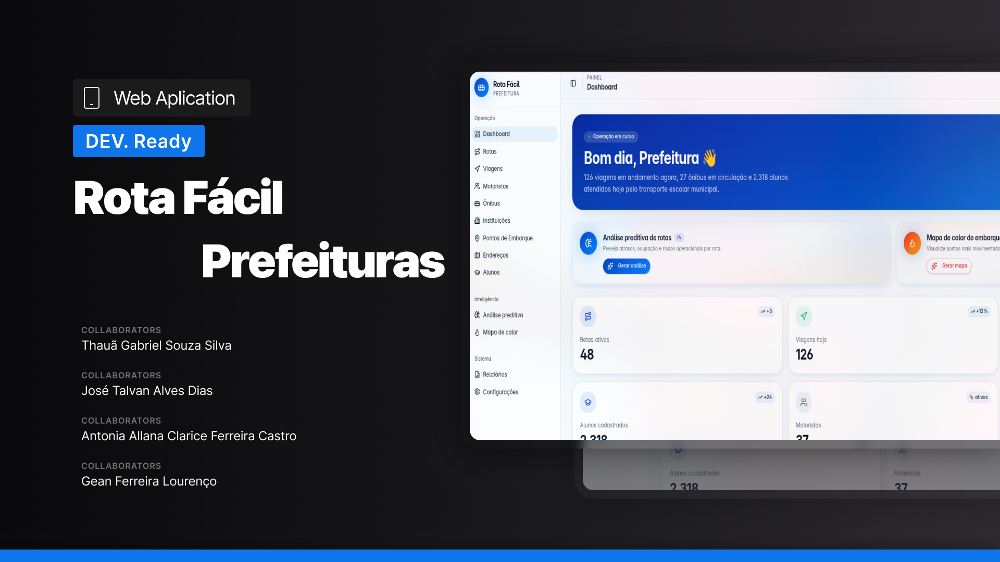

# Rota Fácil Prefectures- Plataforma de gerenciamento inteligente para transporte escolar municipal

 

O Rota Fácil Prefeitura é o módulo administrativo da plataforma Rota Fácil, desenvolvido para centralizar e otimizar o gerenciamento do transporte escolar municipal. A aplicação oferece aos gestores públicos uma visão completa das operações relacionadas ao transporte de estudantes, permitindo o acompanhamento e a administração dos principais recursos envolvidos no serviço.

Através da plataforma, é possível realizar o gerenciamento de alunos, motoristas, veículos, frotas, rotas e viagens, além de acompanhar informações operacionais que auxiliam na tomada de decisões e no planejamento das atividades diárias. O sistema foi concebido para reduzir processos manuais, aumentar a rastreabilidade das operações e melhorar a comunicação entre os diferentes setores envolvidos no transporte escolar.

Desenvolvida com Next.js e TypeScript, a aplicação utiliza uma arquitetura moderna baseada em componentes reutilizáveis, organização modular e boas práticas de desenvolvimento front-end. O projeto integra um ecossistema maior composto por aplicações web, aplicações móveis e serviços independentes responsáveis pela gestão completa do transporte escolar municipal.

A documentação do projeto foi organizada em arquivos independentes para facilitar a manutenção, consulta e evolução da aplicação ao longo do desenvolvimento.

A documentação do projeto foi organizada em arquivos separados para facilitar manutenção, leitura e evolução da aplicação ao longo do desenvolvimento.

📌 [Como contribuir](./docs/CONTRIBUTING.md)
📌 [Estrutura do projeto](./docs/PROJECT_STRUCTURE.md)
📌 [Como executar o projeto](./docs/RUNNING.md)
