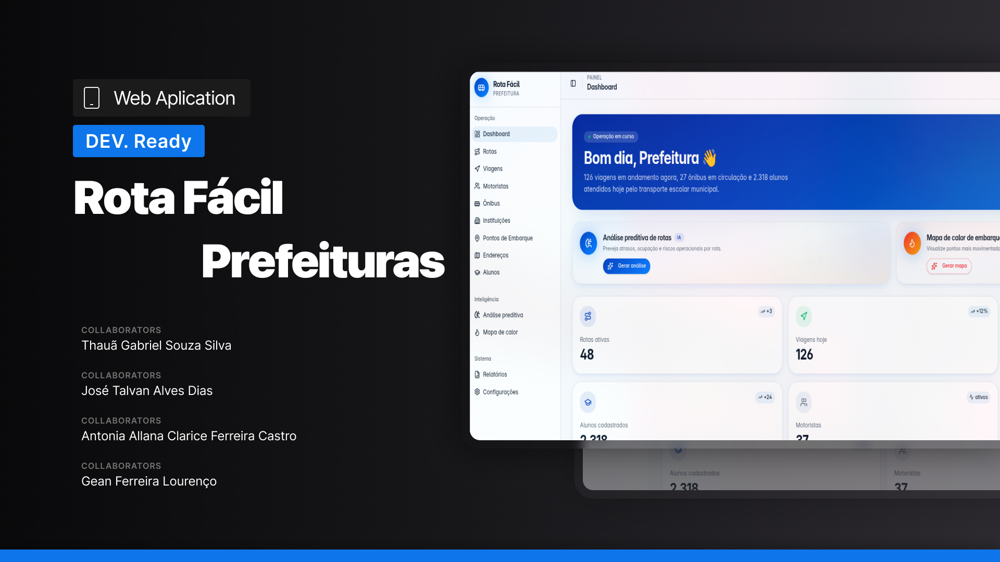

# Rota Fácil Prefeitura

Painel administrativo do Rota Fácil para gestão e acompanhamento do transporte escolar municipal.



## Funcionalidades

- Home com métricas operacionais, mapa de viagens ativas e notificações no sino do header.
- Gestão de estudantes, motoristas, ônibus, instituições, pontos de embarque, rotas e viagens.
- Visualização do progresso da viagem em mapa e modal detalhado.
- Consulta dos feedbacks e notas recebidos por estudantes e motoristas.
- Auditoria com filtros.
- Análise preditiva de rotas e mapa de calor.
- Relatórios PDF de faltas e viagens canceladas.
- Link para observabilidade/Grafana no menu de sistemas.

## Stack

Next.js `16.2.7`, React `19.2.4`, TypeScript, Tailwind CSS v4, Biome, Base UI/shadcn, React Hook Form, Zod, Sonner, date-fns e bibliotecas de ícones.

## Rotas

Rotas autenticadas: `/home`, `/students`, `/drivers`, `/institutions`, `/board-points`, `/bus`, `/routes`, `/trips`, `/predictive-analysis`, `/heat-map`, `/audit` e `/report`.

A rota `/` redireciona para `/home`. Login fica em `/login` e o callback Google em `/oauth2/callback`.

## Integração

As chamadas HTTP ficam em `src/service` e usam o gateway configurado em `NEXT_PUBLIC_WEB_BASE_URL`, normalmente `http://localhost:8080`. O token é enviado como `Authorization: Bearer ...`.

Variáveis públicas:

- `NEXT_PUBLIC_WEB_BASE_URL`
- `NEXT_PUBLIC_GOOGLE_LOGIN_PREFECTURE_URL`
- `NEXT_PUBLIC_GRAFANA_URL`

Não coloque segredos em variáveis `NEXT_PUBLIC_*`.

## Como rodar

```bash
cd rota-facil-prefecture
npm install
npm run dev
```

O servidor de desenvolvimento usa `http://localhost:3001`.

## Validação

```bash
npm run lint
npm run typecheck
npm run build
```

O atalho `npm run check` executa lint e typecheck; `npm run check:ci` também executa o build.

## Estrutura e contribuição

- [Como contribuir](./docs/CONTRIBUTING.md)
- [Estrutura do projeto](./docs/PROJECT_STRUCTURE.md)
- [Como executar](./docs/RUNNING.md)
